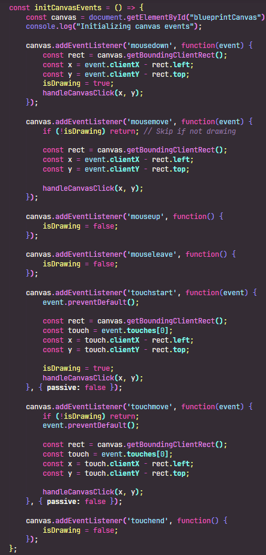
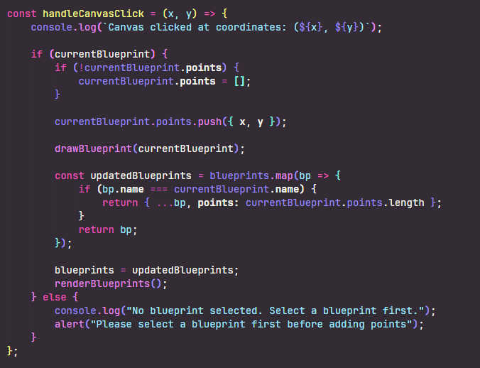
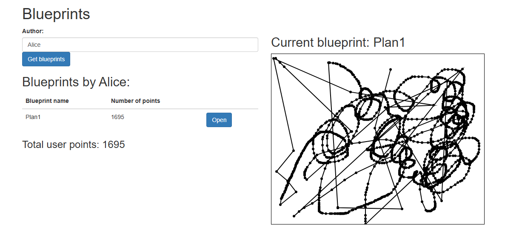
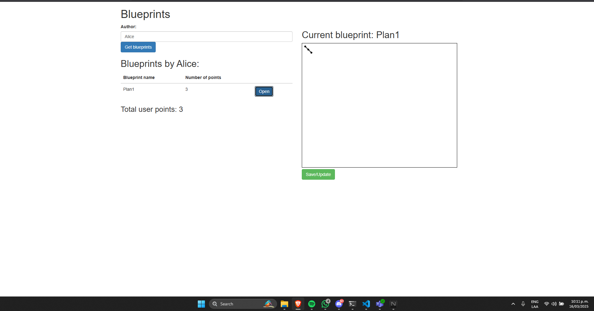
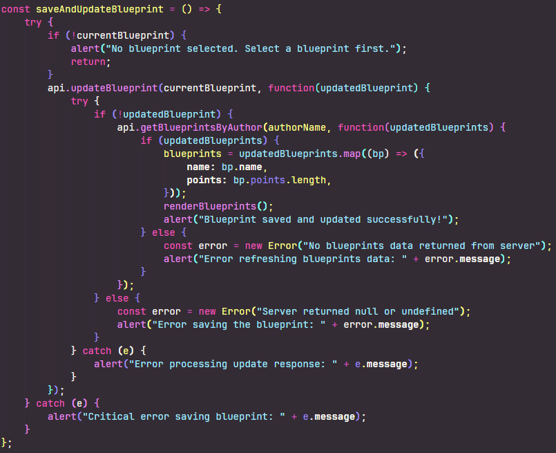
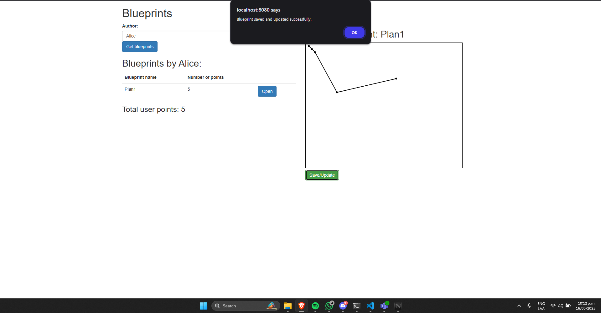
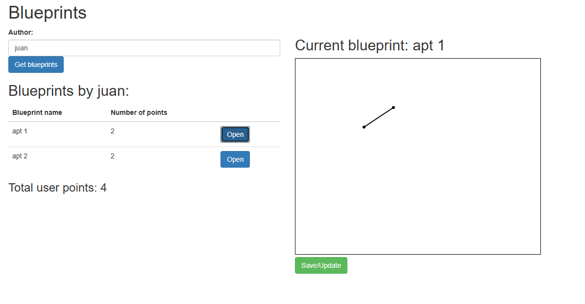
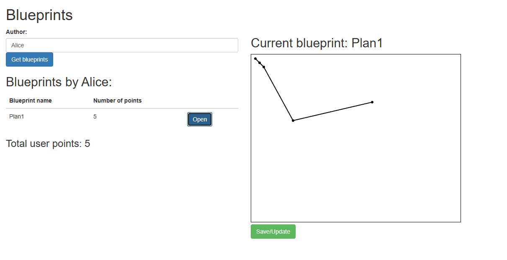

# ARSWLAB07

### Andrea Valentina Torres Tobar
### Andres Serrato Camero

### punto 1 

Agregue al canvas de la página un manejador de eventos que permita capturar los 'clicks' realizados, bien sea a través del mouse, o a través de una pantalla táctil. 

### punto 2

Agregue lo que haga falta en sus módulos para que cuando se capturen nuevos puntos en el canvas abierto (si no se ha seleccionado un canvas NO se debe hacer nada):

we modify `app.js` in const **initCanvasEvents**

and **handleCanvasClick** 

### punto 3

implementation  

we open other person 

and return to *Alice*

